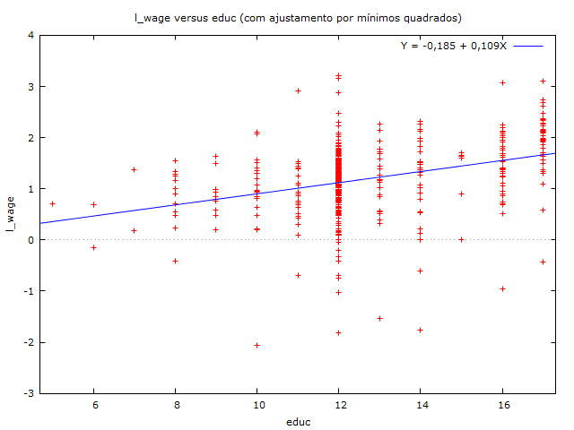

wage - Ganho médio por hora da esposa em dólares em 1975.  
educ - Formação educacional da esposa, em anos.  
exper - Anos de experiência anterior no mercado de trabalho da esposa.  
hours - Horas trabalhadas pela esposa em 1975.  
kidsl6 - Número de crianças com menos de 6 anos no domicílio.
largecity - Variável Dummy (1 se mora em cidade grande, 0 caso contrário)  
siblings - Número de irmãos da esposa.  
fathereduc - Nível de educação do pai da esposa.  
mothereduc - Nível de educação da mãe da esposa.  

Os instrumentos estão em letra padrão;  
A variável de interesse está em negrito;  
As variáveis regressoras que tabém são instrumentos estão em italico.  

wage(salario) ~ **educ(mulher)** + *exper* + *hours* + *kidsl6* + *largecity* + siblings + fathereduc + mothereduc  

\begin{center}

Modelo 9: MQ2E, usando as observações 1--428\\
Variável dependente: l\_wage\\
Instrumentado: educ \\
Instrumentos: const siblings fathereduc mothereduc exper hours kidsl6 \\
largecity \\
Erros padrão robustos à heteroscedasticidade, variante HC1

\vspace{1em}

\begin{tabular}{lr@{,}lr@{,}lr@{,}lr@{,}l}
  &
 \multicolumn{2}{c}{Coeficiente} &
  \multicolumn{2}{c}{Erro\ Padrão} &
   \multicolumn{2}{c}{razão-$t$} &
    \multicolumn{2}{c}{p-valor} \\[1ex]
const &
  0&255083 &
    0&440924 &
      0&5785 &
        0&5632 \\
educ &
  0&0581777 &
    0&0345822 &
      1&682 &
        0&0932 \\
exper &
  0&0167067 &
    0&00437971 &
      3&815 &
        0&0002 \\
hours &
  $-$5&78318\textrm{e--005} &
    6&66148\textrm{e--005} &
      $-$0&8682 &
        0&3858 \\
kidsl6 &
  $-$0&0344118 &
    0&103694 &
      $-$0&3319 &
        0&7402 \\
largecity &
  0&0952688 &
    0&0684986 &
      1&391 &
        0&1650 \\
\end{tabular}

\vspace{1ex}
\begin{tabular}{lrlr}
Média var. dependente &  1,190173 & D.P. var. dependente &  0,723198 \\
Soma resíd. quadrados &  194,3264 & E.P. da regressão &  0,678594 \\
$R^2$ &  0,140161 & $R^2$ ajustado &  0,129973 \\
$F(5, 422)$ &  4,557122 & P-valor($F$) &  0,000465 \\
\end{tabular}

\vspace{1em}
\begin{raggedright}
Teste de Hausman --\\
\quad Hipótese nula: as estimativas por MQO são consistentes\\
\quad Estatística de teste assintótica: $\chi^2(1)$ = 3,02292\\
\quad com p-valor = 0,0820958\\
\vspace{1ex}
Teste de Sargan para a sobre-identificação --\\
\quad Hipótese nula: todos os instrumentos são válidos\\
\quad Estatística de teste: LM = 0,584092\\
\quad com p-valor = $P$($\chi^2(2) >$ 0,584092) = 0,746734\\
\vspace{1ex}
Teste de instrumento fraco -- \\
\quad First-stage $F(3, 420)$ = 30,4599 \\
\end{raggedright}

\end{center}

Ajustar um novo modelo sem as variáveis não significativas no modelo.

\newpage

wage - Ganho médio por hora da esposa em dólares em 1975.  
educ - Formação educacional da esposa, em anos.  
exper - Anos de experiência anterior no mercado de trabalho da esposa.  
siblings - Número de irmãos da esposa.  
fathereduc - Nível de educação do pai da esposa.  
mothereduc - Nível de educação da mãe da esposa.  

Os instrumentos estão em letra padrão;  
A variável de interesse está em negrito;  
As variáveis regressoras que tabém são instrumentos estão em italico.  

wage(salario) ~ **educ(mulher)** + *exper* + siblings + fathereduc + mothereduc  

\begin{center}

Modelo 10: MQ2E, usando as observações 1--428\\
Variável dependente: l\_wage\\
Instrumentado: educ \\
Instrumentos: const siblings fathereduc mothereduc exper \\
Erros padrão robustos à heteroscedasticidade, variante HC1

\vspace{1em}

\begin{tabular}{lr@{,}lr@{,}lr@{,}lr@{,}l}
  &
 \multicolumn{2}{c}{Coeficiente} &
  \multicolumn{2}{c}{Erro\ Padrão} &
   \multicolumn{2}{c}{razão-$t$} &
    \multicolumn{2}{c}{p-valor} \\[1ex]
const &
  0&171469 &
    0&423132 &
      0&4052 &
        0&6855 \\
educ &
  0&0645310 &
    0&0330625 &
      1&952 &
        0&0516 \\
exper &
  0&0154796 &
    0&00414108 &
      3&738 &
        0&0002 \\
\end{tabular}

\vspace{1ex}
\begin{tabular}{lrlr}
Média var. dependente &  1,190173 & D.P. var. dependente &  0,723198 \\
Soma resíd. quadrados &  194,7016 & E.P. da regressão &  0,676847 \\
$R^2$ &  0,140122 & $R^2$ ajustado &  0,136075 \\
$F(2, 425)$ &  8,586489 & P-valor($F$) &  0,000221 \\
\end{tabular}

\vspace{1em}
\begin{raggedright}
Teste de Hausman --\\
\quad Hipótese nula: as estimativas por MQO são consistentes\\
\quad Estatística de teste assintótica: $\chi^2(1)$ = 2,74038\\
\quad com p-valor = 0,0978414\\
\vspace{1ex}
Teste de Sargan para a sobre-identificação --\\
\quad Hipótese nula: todos os instrumentos são válidos\\
\quad Estatística de teste: LM = 0,828443\\
\quad com p-valor = $P$($\chi^2(2) >$ 0,828443) = 0,660854\\
\vspace{1ex}
Teste de instrumento fraco -- \\
\quad First-stage $F(3, 423)$ = 33,8202 \\
\end{raggedright}

\end{center}

Note que não rejeitamos a hipótese de nula, e o teste de instrumento fraco indicou 33,8202 que é maior que 10 (<10 indica instrumentos fracos)

\newpage

MODELO SEM INSTRUMENTOS:

\begin{center}

Modelo 1: MQO, usando as observações 1--428\\
Variável dependente: l\_wage\\
Erros padrão robustos à heteroscedasticidade, variante HC1

\vspace{1em}

\begin{tabular}{lr@{,}lr@{,}lr@{,}lr@{,}l}
  &
 \multicolumn{2}{c}{Coeficiente} &
  \multicolumn{2}{c}{Erro\ Padrão} &
   \multicolumn{2}{c}{razão-$t$} &
    \multicolumn{2}{c}{p-valor} \\[1ex]
const &
  $-$0&400174 &
    0&182819 &
      $-$2&189 &
        0&0291 \\
exper &
  0&0156736 &
    0&00408097 &
      3&841 &
        0&0001 \\
educ &
  0&109489 &
    0&0133353 &
      8&210 &
        0&0000 \\
\end{tabular}

\vspace{1ex}
\begin{tabular}{lrlr}
Média var. dependente &  1,190173 & D.P. var. dependente &  0,723198 \\
Soma resíd. quadrados &  190,1950 & E.P. da regressão &  0,668968 \\
$R^2$ &  0,148358 & $R^2$ ajustado &  0,144350 \\
$F(2, 425)$ &  40,12862 & P-valor($F$) &  1,09\textrm{e--16} \\
Log da verossimilhança & $-$433,7360 & Critério de Akaike &  873,4720 \\
Critério de Schwarz &  885,6493 & Hannan--Quinn &  878,2813 \\
\end{tabular}

\end{center}
